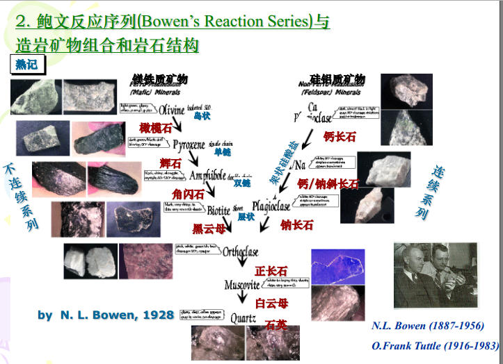

## （1）内力地质作用的概念及主要类型。
- **地质作用**：
地质作用就是形成和改变地球的物质组成，外部形态特征与内部构造的各种自然作用。
- **内力地质作用的概念**：
内力地质作用以地球内能为能源并主要发生在固体地球内部，包括岩浆作用、构造作用、地震作用、变质作用、地球各层圈相互作用。

## （2）岩浆作用、变质作用、构造运动的一般概念及基本类型、特征。
- **岩石分类**：
由一种以上矿物组合形成的固体，按形成方式分，岩石分为三大类：**岩浆岩、变质岩、沉积岩**。岩浆岩占地壳岩石体积的64.7%，沉积岩占7.9%，变质岩占27.4%（**火＞变＞沉**）。

### ① 岩浆作用
#### 一般概念
岩浆作用是指**岩浆发育、运动、冷凝固结**成为火成岩的作用。它包括**喷出作用**和**侵入作用**。

#### 喷出作用
- **喷出作用**：岩浆喷出地表，冷凝固结的过程，称为喷出作用，又称火山作用。它伴随着地下大量物质在很短时间内上涌，向外喷发释放。
- **火山喷发方式**：一种是岩浆沿管状通道上升，从火口中喷发，称为中心式喷发；另一种是岩浆沿地壳中裂缝喷出，称为裂隙式喷发。

#### 侵入作用
- **侵入作用**：
深部岩浆向上运移，侵入周围岩石，在地下冷凝、结晶、固结成岩的过程，称为侵入作用。其形成的岩石，称为侵入岩。
- **侵入岩的产状**：
    1. 岩墙：
    也称岩脉，呈狭长形的侵入体.它是岩浆沿围岩的裂缝挤入后冷凝形成的。
    2. 岩床：
    围岩为成层的岩石，岩浆顺围岩的层间空隙挤入，扩展后、冷凝，固结成岩，其厚度常为数米到数百米。
    3. 岩盆与岩盖：
    围岩为近于水平延伸的成层的岩石，侵入体的展布与围岩的成层方向大致吻合，侵入体的中间部分略向下凹，似盆状，称为盆；如果侵入体底平而顶凸，延伸方向与围岩的成岩方向大致平行，似蘑菇状者，称为岩盖。
    4. 岩株：
    横截面积为数十平方千米以内的侵入体，其形态不规则，与围岩的接触面不平直。边缘常有规模较小，形状规则或不规则的分支侵 入体贯入围岩之中。
    5. 岩基：
    规模极大的侵入体。其形态不规则.通常沿一个方向延伸.边界弯曲，其边缘常以规模较小的岩株或岩脉形式穿插到围岩中、岩基主要由英岗岩组成。
    6. 捕虏体：
    岩浆在侵入作用过程中所捕获的围岩碎块，其形状和大小不一，由于在围岩崩落时发生移动，其构造方向与围岩整体的构造方向常不一致。

#### 岩浆、喷出岩和侵入岩的分类
一般根据SiO₂含量对岩浆进行分类。岩浆中**SiO₂含量越高，黏性越大**。

| 岩浆类型 | 超基性岩浆 | 基性岩浆 | 中性岩浆 | 酸性岩浆 |
|--------|----------|--------|--------|----------|
| SiO₂含量范围 | < 45% | 40%-52% | 52%-65% | > 65% |

代表性岩石：

- 喷出岩：
    - 超基性喷出岩：科马提岩
    - 喷出岩基性喷出岩：玄武岩
    - 中性喷出岩：安山岩
    - 酸性喷出岩：流纹岩
- 侵入岩：
    - 超基性侵入岩：橄榄岩
    - 基性侵入岩：辉长岩
    - 侵入岩中性侵入岩：闪长岩
    - 酸性侵入岩：花岗岩

#### 世界火山的分布
1. 环太平洋火山带；
2. 地中海-印度尼西亚火山带；
3. 洋脊火山带；
4. 红海沿岸与东非火山带。

#### 火成岩（即岩浆岩）
- **火成岩的主要矿物**：
橄榄石、辉石、角闪石、黑云母。

- **火成岩的结构及主要类型**：
    - 火成岩的结构是指火成岩中矿物的结晶程度、晶粒大小、形态及晶粒间的相互关系。它能反映岩浆结晶的冷凝速度、温度和深度。
    - 按照矿物晶粒的大小，将火成岩的结构分为粗粒（粒径>5mm）、中粒（粒径1-5mm）、细粒（粒径<1mm）。这些结构用肉眼均可识别，统称为显晶质结构。
    - 按照矿物颗粒之间的相对大小，分为等粒结构及不等粒结构。
    - 在不等粒结构中，其中粗大者称为斑晶，其晶形完整。细小者称为基质，其晶形多不规则。如果基质为显基质，且基质的成分与斑晶的成分相同者，称为似斑状结构。如果基质为隐晶质或非晶质者，则称为斑状结构。

- **火成岩多样化的原因**：
    - **同化作用**：
    同化作用指岩浆熔化围岩，将围岩改变成为岩浆的一部分，即巨量高温熔融体熔化周围规模较小的先存低温物体。同化作用的规模和程度受岩浆的成分、温度、规模以及围岩的规模和性质控制。
    - **混染作用**：
    岩浆规模不够大，不足以吞噬围岩，导致围岩对岩浆的明显化学反应，从而改变岩浆的成分。
    - **同化混染作用**：
    岩浆熔化围岩，将围岩改变成为岩浆的一部分。同时，因岩浆体积不够大，不足以完全吞噬围岩，导致围岩对岩浆的明显化学反应，从而改变岩浆的成分。这一现象称为同化混染作用。
    - **结晶分异作用**：
    岩浆在冷凝过程中，按一定规律依次结晶出不同矿物的过程。熔点高比重大的矿物先结晶，导致岩浆成分不断变化。
    - **岩浆结晶**出的岩石**顺序**：
    超镁铁岩（橄榄岩）--> 镁铁岩（辉长岩）--> 中性岩（闪长岩）--> 酸性岩（花岗岩）--> 伟晶岩。
    - **鲍温反应系列**：
    简称反应系列。岩浆在结晶作用过程中，由于物理化学条件的改变，先析出的矿物与岩浆发生反应，鲍温反应系列使矿物成分发生变化，产生新的矿物。

  

### ② 变质作用
#### 一般概念
变质作用，岩石基本处于固态状态下，受到**温度、压力和化学活动性流体**的作用，发生**矿物成分、化学成分、岩石结构构造**的变化，形成新的结构、构造或新的岩石与矿物的地质作用，称为变质作用。经历变质作用后形成的岩石称变质岩。变质岩形成后还可经历新的变质作用过程，有的变质岩是多次变质作用的产物。

#### 基本类型
1. **接触变质作用**：
**由岩浆活动引起**的，发生在**火成岩与围岩接触带范围**的变质作用，称为接触变质作用。按照变质过程中有无交代作用，可分为接触热变质作用和接触交代变质作用。
2. **区域变质作用**：
是指在**广大范围内由温度、压力以及化学活动性流体等多种因素引起**的变质作用。区域变质作用中，温度和压力总是联合作用的。
3. **混合岩化作用**：
当区域变质作用进一步发展，特别是在温度很高时，岩石受热而发生部分熔融并形成酸性成分的熔体，同时由地下深部也能分泌出富含钾、钠、硅的热液。这些**熔体和热液**沿着已形成的区域变质岩的裂隙或片理进行**渗透、扩散、贯入**，**甚至和变质岩发生化学反应**，以形成新的岩石，这种作用即为混合岩化作用。
4. **动力变质作用**：
是由于地壳运动的影响，岩石在**强烈定向压力下发生变化**的一种变质作用。多分布在大型断裂带附近。

#### 变质岩
1. **变质岩的类型**：
    1. **接触变质作用**：
        - 接触热变质作用：角岩、斑点角岩、大理岩、石英岩
        - 接触交代变质作用：矽卡岩
    2. **区域变质作用**：板岩、千枚岩、片岩、片麻岩

    3. **混合岩化作用**：混合花岗岩

2. **变质岩的结构及主要类型**：
    火成岩和沉积岩的结构通过变质作用可以全部或部分消失，形成变质岩特有的结构，主要有变晶结构、变余结构、碎裂结构、交代结构。
    - **变晶结构**：
    指岩石**在固体状态下，过重结晶或变质结晶而形成的结构**。它表现为矿物形成、长大而且晶粒相互紧密嵌合。变晶结构的出现标志着火成岩及沉积岩中特有的非晶质结构、碎屑结构及生物骨架结构趋于消失，并伴随着物质成分的迁移和新矿物的形成。
    - **变余结构**：
    指**变质程度不深时残留的原岩结构**。如变余斑状结构；变余砾状、砂状结构。

### ③ 构造运动
#### 一般概念
由地球内动力引起岩石圈地质体变形、变位的机械运动。

#### 基本类型
1. **水平运动（造山运动）**：

    水平运动是**地壳或岩石圈块体沿水平方向的移动**。有三种基本方式：①相邻块体**背向分离**；②相邻块体**相向汇聚**；③相邻块体**剪切错开**。剪切、错开的相邻块体既不分离，也不汇聚。同一地区，有时挤压，有时拉伸，有时走滑。**水平运动往往会导致岩层的弯曲和断裂**。

2. **垂直运动（升降运动）**：

    垂直运动是**相邻块体或同一块体的不同部分做差异性上升或下降**，使某些地区上升成为高地或山岭，另一些地区下降为盆地或平原。“沧海桑田”是古人对地壳垂直运动的一种表述。实际上，垂直运动不仅能使沧海变为桑田而且**能使大海变为高山**。垂直运动**也能导致岩层的弯曲和断裂**。
