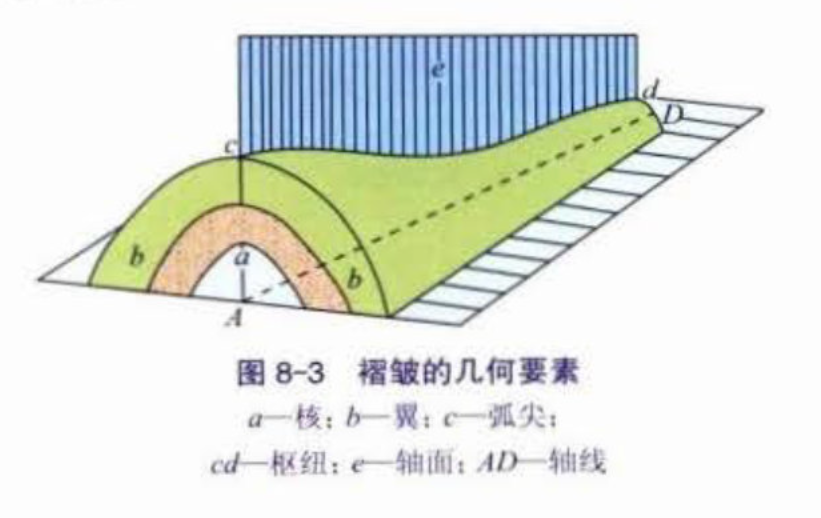
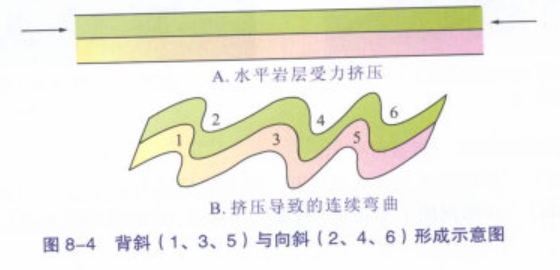
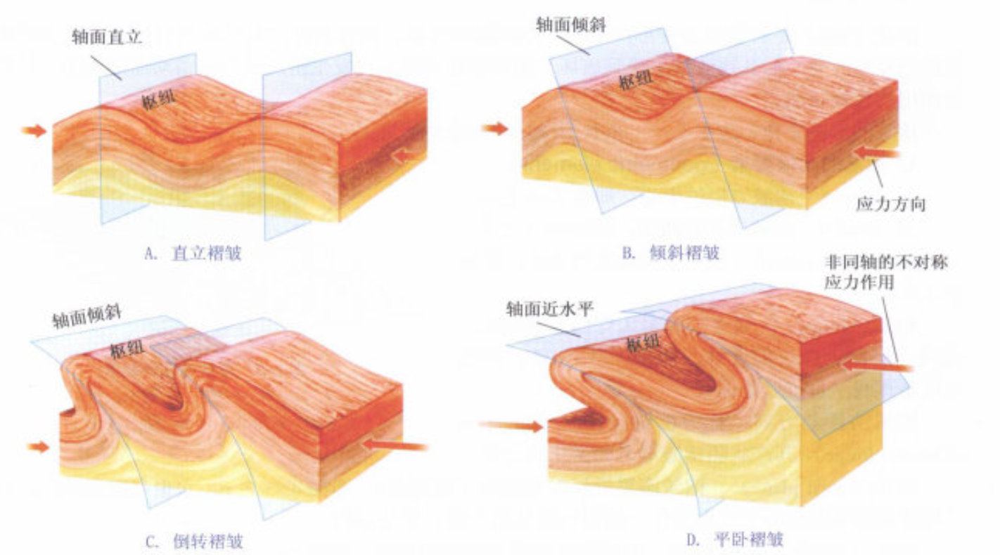
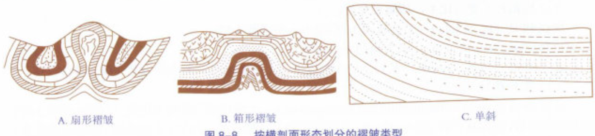
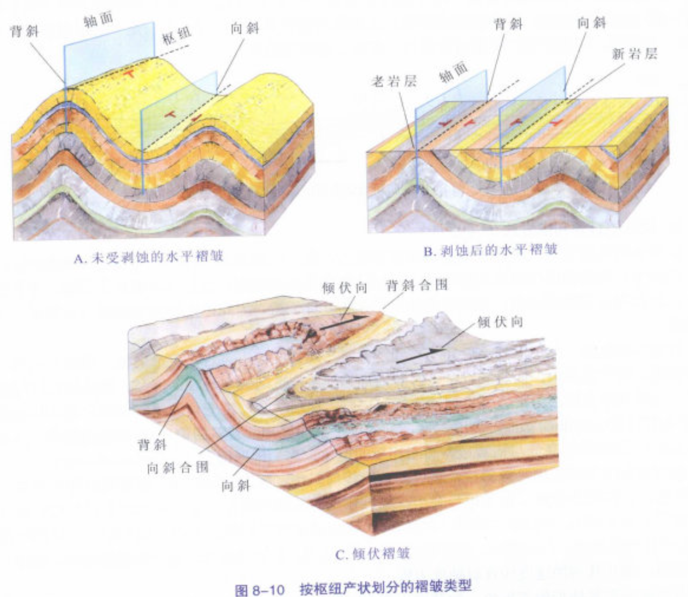
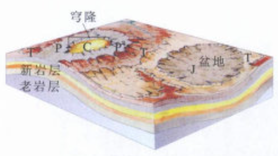
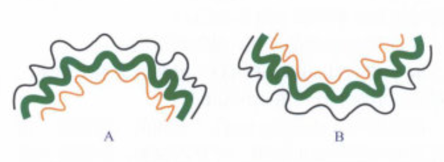
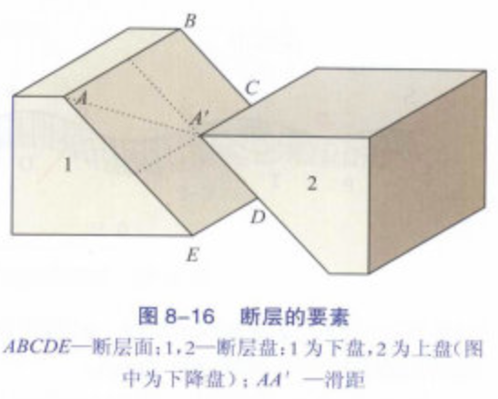
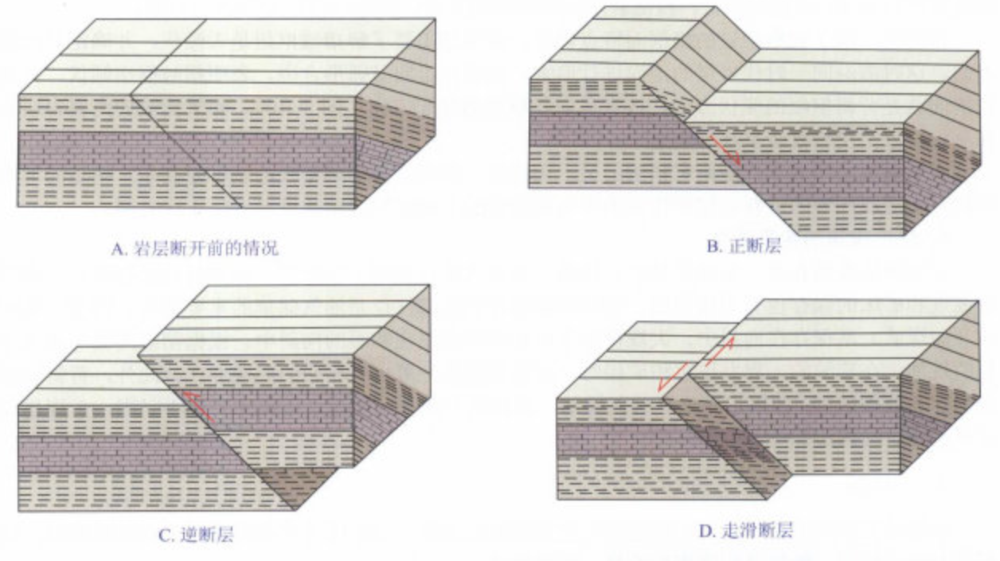
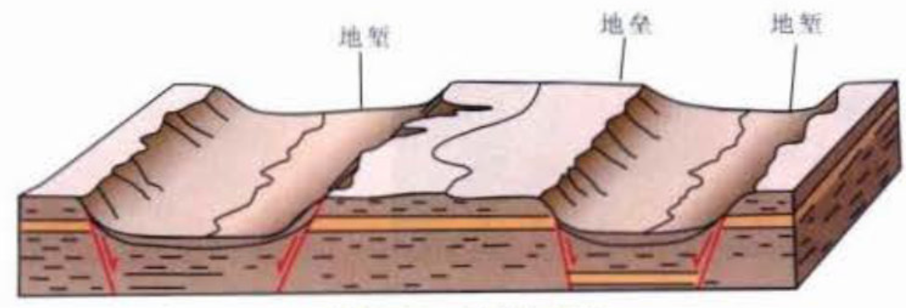

***❗估计重点在褶皱、断层、节理，别的稍微看看就行***
## （1）构造地质学的一般原理。
构造地质学是研究地壳岩石变形、构造形态及其形成过程的学科，其一般原理涵盖了从微观到宏观尺度的岩石变形机制、地质构造的形成和发展。以下是构造地质学的一些核心原理：

1. **地壳运动与应力**：
    - 板块运动是构造变形的动力，应力类型：挤压、拉张、剪切。

2. **岩石变形机制**：
    - 弹性变形、塑性变形、脆性断裂。

3. **主要构造形态**：
    - **褶皱**：背斜（老岩层在核部）、向斜（新岩层在核部）。
    - **断层**：
        - 正断层（上盘下降，拉张应力）。
        - 逆断层（上盘上升，挤压应力）。
        - 平移断层（水平滑动，剪切应力）。
    - **节理**：岩石裂缝，无明显位移。

4. **构造演化**：
    - 通过构造形态和叠加关系推断构造运动历史。

5. **构造与矿床**：
    - 断裂、褶皱等构造控制矿床形成与分布。

6. **构造与地质灾害**：
    - 断层活动引发地震，构造影响滑坡、泥石流等。

## （2）褶皱、断层、*解理*（节理）的一般特征及其野外识别标志。

***⚠️注意！此处应该是考研大纲出现了错误🚫，应该是“节理”，二者应该注意区分：***

> **节理**是岩石中的**断裂构造**，是**地质构造活动**的结果，具有方向性和无明显位移的特征。
**解理**是矿物的固有物理性质，是**矿物晶体结构**的反映，具有方向性、平行性和光滑度的特征。

    

> **产状**：岩层产状是指即岩层的产出状态，产状以**走向**、**倾向**和**倾角**表示，称为岩层**产状三要素**。

- **走向**：层面与假想水平面交线走向，它标志着岩层的延伸方向。
- **倾向**：层面与走向垂直并指向下方的直线，称为倾斜线，它的水平投影所指方向，即为倾向，它表示层面倾斜的方向，恒与走向垂直。
- **倾角**：层面与假想水平面的最大交角，沿着倾向方向测量的倾角，称为真倾角，沿其他方向测量的交角较真倾角更小，称为视倾角。

### ① 褶皱
#### 褶皱的一般特征
**褶皱是岩层受力产生的一系列连续弯曲**。褶皱的基本单位是**褶曲**，指一个先存岩石面因连续变形而形成的弯曲。岩层褶皱后原有的位置和形态均已发生改变，但其连续性未受到破坏。褶皱是由相邻岩块发生挤压或剪切错动而形成的，是构造作用的直观反映。

1. **褶皱的几何要素**：
    - **核**：褶皱岩层的中心。
    - **翼**：褶皱岩层的两坡。
    - **转折端**：从褶皱一翼过渡到另一翼的转折汇合部位，在横截面上为一段曲线。其最大弯曲点称弧尖。
    - **枢纽**：单个层面最大弯曲点的连线，或同一层面上弧尖的连线，枢纽可以是直线，也可以是曲线。枢纽的倾斜方向，称为枢纽倾伏向。
    - **轴面**: 褶皱两翼近似对称的面(假想面)，它也可以是曲面，其产状随着褶皱形态的变化而变化。轴面与褶皱的交线，就是枢纽。
    - **轴线**：轴面与水平面或地面的交线

    

2. **褶皱的类型**：

    😒👌*我觉得搞懂**向斜**和**背斜**就够了呀*

    1. 褶皱的**基本类型是背斜与向斜**：
        1. **背斜**：
        岩层**向上弯曲**，形成一个拱形结构。背斜的核部通常由较老的岩层组成，而两翼则由较新的岩层构成。
        2. **向斜**：
        岩层**向下凹陷**，形成一个谷形结构。向斜的核部由较新的岩层组成，而两翼由较老的岩层构成。

        

    2. 根据轴面产状，可分为直立褶皱、倾斜褶皱、倒转褶皱、平卧褶皱；
        - **直立褶皱**：轴面近于直立，两翼倾向相反，倾角近于相等。
        - **倾斜褶皱**：轴面倾斜，两翼岩层倾斜方向相反，倾角不等。
        - **倒转褶皱**：轴面倾斜，两翼岩层顺斜方向相同，倾角不等。
        - **平卧褶皱**：轴面近于水平，两翼岩层产状近于水平重叠。一翼岩层为正常层序，一翼岩层为倒转层序。

        

    3. 根据横剖面形态特点，可划分为扇形褶皱、箱形褶皱、单斜；

        

    4. 根据枢纽的产状，可划分为水平褶皱、倾伏褶皱；

        

    5.  根据长宽比，可划分为：
        - 线状褶皱：长/宽 > 10
        - 短轴褶皱：3 <= 长/宽 <=10
        - 穹与盆：长/宽 < 3。上凸者为穹，下凹者为盆
        
        

    6. 根据褶皱组合形式，可划分为复背斜与复向斜、隔挡式褶皱与隔槽式褶皱。

        

#### 褶皱的野外识别标志

***哎，稍微看看就好。***

**记几个关键词，然后编：① 岩层对称； ② 背斜核部老两翼新，向斜核部新两翼老；③ 背斜成谷，向斜成山（地形倒置）**

1. 岩层重复与对称性：
    - 垂直于岩层走向，观察岩层是否对称重复出现，常见于褶皱构造。

2. 岩层年代关系：
    - 背斜：核部岩层老，两翼岩层新。
    - 向斜：核部岩层新，两翼岩层老。

3. 地形特征：
    - 背斜常形成谷地，向斜常形成山脊（地形倒置）。

4. 岩层产状变化：
    - 观察岩层的倾斜方向和角度变化，判断褶皱的存在。

5. 节理和断层：
    - 褶皱区域常伴随节理和断层发育，观察这些特征可辅助识别。

6. 地貌标志：
    - 观察山脊和谷地的排列与形态，判断褶皱类型。

### ② 断层
> 断裂：断裂是岩石的破裂，是岩石的连续性受到破坏的表现。**断裂包括断层与节理**。

#### 断层的一般特征
**岩石破裂，并且沿破裂面两侧的岩块有明显相对位移者，称为断层**。

1. **断层的几何要素**：
    1. **断层面**：分隔两个岩块并使其发生相对滑动的面。
    2. **断层盘**：被断开的两部分岩块，其中位于断层面之上的，称为上盘岩块；位于断层面之下的，称为下盘岩块。相对上升者称为上升盘，相对下降者称为下降盘，上盘和下盘都可以是上升盘或下降盘。
    3. **断层滑距**：断层两盘发生相对移动的距离。断层两盘相当的点，因断裂而发生移动，其两点的直线距离，称为滑距，代表真位移。
    

2. **断层命名（分类）**
    1. **根据两盘滑动方向**：
        1. **正断层**：上盘向下滑动，下盘向上滑动。
        2. **逆断层**：上盘向上滑动，下盘向下滑动。其中倾角<25°，称为逆掩断层；
        3. **平移断层**：也称**走滑断层**，被断的岩块沿陡立的断层面做水平滑动；根据相对滑动方向，可分为左旋和右旋。
        
    2. 根据断层走向与地层走向的关系分类：
        1. 走向断层：断层走向与地层走向大致平行；
        2. 倾向断层：断层走向与地层倾向大致垂直；
        3. 斜向断层：断层走向与地层走向斜交。
    3. 根据断层的组合形式：
        1. **地垒**：是倾斜面相背的两个正断层所夹持的共同下盘岩块，常为山岭；
        2. **地堑**：是倾斜面相向的两个正断层所夹持的共同上盘岩块，常为谷地。
        

#### 断层的野外识别标志
断层的野外识别通常分两步进行，第一步**先识别断面及其产状**，可以根据地形地貌标志、地层标志、构造标志、岩浆活动等标志确定断面；第二步**判断断层的性质**，可以根据被断层错断的标志体、断裂带内的擦痕、牵引构造、逆牵引构造等运动学标志判断断层两盘的相对运动方向。

### ③ 节理
#### 节理的一般特征
- 在地质作用下，岩块受力变形和破裂，形成一系列破裂面，若破裂面两侧岩块**没有发生明显位移**，此破裂称为**节理**。节理的裂开面称为**节理面**。

- **节理的分类**：

    1. 按成因可分为原生节理和次生节理
        1. **原生节理**：产生在成岩过程中的节理；如玄武岩的柱状节理。
        2. **次生节理**：分为构造节理和非构造节理；构造节理是由内动力作用形成的；非构造节理是由外动力作用形成的。
    2. 按力学性质可分为张节理和剪节理
        1. **张节理**：是在垂直于主应力方向上发生张裂而形成的。张节理面一般不平坦，裂缝较粗糙，裂缝较宽，常被岩石或矿脉充填。
        2. **剪节理**：是由剪切作用而形成的。剪节理面一般平直光滑，裂缝细小，延伸稳定。剪节理多成群出现，构成平行排列和雁行排列的节理组。

#### 节理的野外识别标志

🤔自己瞎编一下吧，就是***裂开了，但又没有移动***

## （3）构造地质学在矿床勘查及工程地质中的运用。

***估计也不考，看看关键词临场发挥就行***

1. 矿床勘查：
    - 控矿构造
    - 断裂控矿
    - 褶皱控矿
    - 岩浆构造控矿
    - 构造演化分析
    - 构造地球化学
    - 构造环境与矿床类型
    - 构造对矿床规模的影响
    - 构造地球物理勘探
    - 地球物理异常

2. 工程地质：
    - 工程选址
    - 构造稳定性
    - 地质灾害预测
    - 地震活动
    - 滑坡与崩塌风险
    - 隧道工程
    - 构造应力场
    - 地下水流动通道
    - 软弱带分析
    - 地质构造对工程的影响
