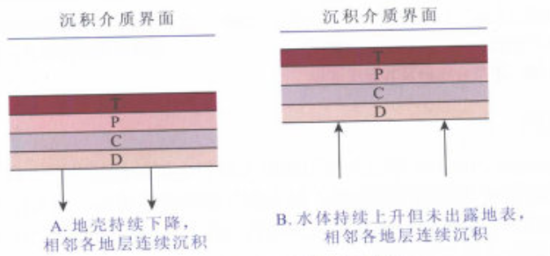
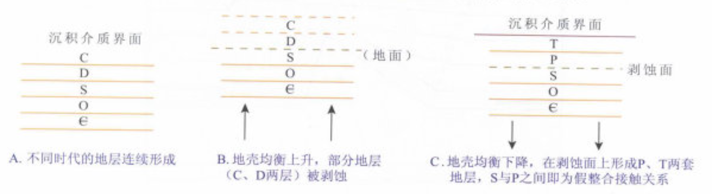

### 1. 地层的接触关系
***❗这是地质构造相关的内容，近两年大纲上没写，但考了***

#### （1）整合接触
整合接触是指相邻的新老地层**产状一致**，它们的岩石性质与生物演化连续而渐变，沉积作用**没有间断**。表明该两套地层是**连续沉积**而成的。在其沉积期，该地区构造运动处于持续下降,或持续上升的状态。

#### （2）假整合接触
假整合接触又称为**平行不整合**接触。相邻的新老地层产状一致，它们的分界面是沉积作用的**间断面**，或称为**剥蚀面**。剥蚀面的产状与相邻的上、下地层产状平行。假整合接触表示地层形成以后，地壳均衡上升，使该地层遭受剥蚀，形成剥蚀面。随后地壳均衡下降，在剥蚀面上重新接受沉积，并形成上覆地层。

#### （3）不整合接触
不整合接触又称度不整合接触。相邻的新、老地层产状不一致，其间有剥蚀面相分隔。