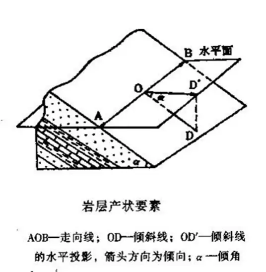
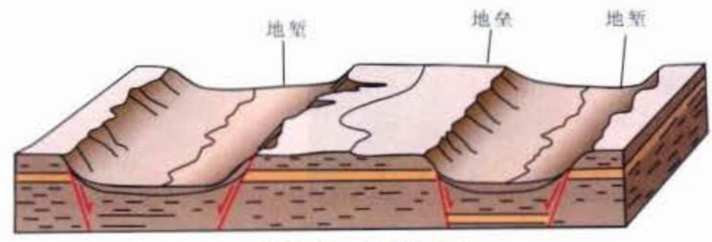

# 1.地球的一般概念及特征（10分）
## （1）地球的一般特征。

地球由固体地球和覆盖其上的水圈、大气圈和生物圈构成。固体地球分为地壳、地幔和地核三大层圈。

## （2）地球的表面形态及内部圈层。
### ① 地球的表面形态
地球的表面形态复杂多样，主要由以下几种主要地貌构成：
1. **陆地**：
   - **山脉**：由地壳板块运动形成，如喜马拉雅山脉和安第斯山脉。
   - **高原**：地势较高且相对平坦的地区，如青藏高原。
   - **平原**：地势低平，适合农业和城市发展，如亚马逊平原。
   - **盆地**：四周高中间低的地形，如四川盆地。
   - **丘陵**：地势起伏较小，坡度较缓的地区。

2. **水体**：
   - **海洋**：覆盖地球表面约71%，分为太平洋、大西洋、印度洋和北冰洋四大洋。
   - **湖泊**：如贝加尔湖和苏必利尔湖，通常是淡水湖泊。
   - **河流**：如亚马逊河和尼罗河，连接陆地和水体，输送淡水资源。
   - **冰川**：覆盖极地和高山地区，如南极洲和格陵兰的冰盖。

3. **其他地貌**：
   - **火山**：如夏威夷的火山，由地壳内部岩浆喷发形成。
   - **峡谷**：如美国的大峡谷，由河流侵蚀形成。
   - **沙漠**：如撒哈拉沙漠，气候干旱，植被稀少。

### ② 地球的内部圈层
地球内部由多个不同的圈层组成，主要分为**地壳、地幔、地核**：

1. **地壳**：
   - 地球最外层的固体岩石层，平均厚度约为30到40公里。
   - 由大陆地壳和大洋地壳组成，前者较厚，后者较薄。
   - 地壳板块运动是地震和火山活动的主要原因。
   - 大陆地壳的成分接近于中性火成岩，其下地壳岩石成分相当于基性麻粒岩，上地壳岩石成分相当于花岗岩；地壳表层则为沉积岩。大陆地壳形成的年代老，内部构造复杂；地壳中最古老的岩石仅产于大陆地壳之中。
   - 洋壳位于大洋底，占地壳面积的2/3，洋壳岩石主要由玄武岩和橄榄岩组成，构造简单。分布在地球上的洋壳都是中生代以来才开始形成的。

2. **莫霍面**：
   - 莫霍面位于地表以下数公里到30-40km深度。纵波速度从平均为6-7km/s，突然上升到8.1km/s。这一突变具有全球性，此界面的深度在大陆深，在海洋浅。**地质上将莫霍面以上部分称为地壳，以下部分称为地幔。**

3. **地幔**：
   - 上地幔 + 过渡层（地幔转换带）+ 下地幔 + D''层（地幔底部层）= 地幔
   - 位于地壳之下，厚度约为2，900公里。
   - 主要由硅酸盐岩石组成，分为**上地幔和下地幔**。
   - 上地幔：
     - 上地幔部分熔融，形成软流圈，是板块运动的主要动力来源。
     - **岩石圈**：**地壳＋软流圈以上的固体地幔**
     - **软流圈**：地下从平均70km深处开始到大约200km深的地带。物质是固态和液态的混合物。由于混有液态物质，所以这一地带的物质比较“软”，易于发生塑性流动，故称之为软流圈。
   - 下地幔： 下地幔主要由更致密的硅酸盐矿物组成，如钙钛矿和镁铁硅酸盐。由于高压和高温，岩石在这里呈固态，但具有可塑性。

4. **古登堡面**：
   - **古登堡面是地幔与地核的分界面**，位于地球表面以下约2900公里处。这一界面是地球内部两个主要圈层之间的分界线，标志着物质状态的显著变化。
   - 在古登堡面之上，地震波（特别是纵波P波和横波S波）能够正常传播。然而，在该面之下，P波的传播速度显著下降，而S波则完全消失。这是因为**地核的外核部分是液态的，而S波只能在固体中传播**。

5. **地核**：
   - **外核**：
     - 位于地幔之下，厚度约为2，270公里。
     - 主要由液态铁和镍组成，温度极高。
     - **液态外核**的流动产生了地球的磁场。
   - **内核**：
     - 位于外核的中心，半径约为1，220公里。
     - 主要由固态铁和镍组成，温度和压力极高。
     - 内核的旋转和运动对地球的磁场和自转有重要影响。


## （3）地球的物理性质。

***😒这里糊弄一下吧，了解一下就行应该***

1. **形状**：
    - **扁球体**：地球并非完美的球体，而是一个赤道略鼓、两极略扁的椭球体。这种形状被称为“扁球体”，是由于地球自转产生的离心力造成的。赤道半径约为6，378公里，极半径约为6，357公里。

2. **质量和密度**：
    - **质量**: 地球的质量约为5.97 × 10^24千克，是太阳系中质量最大的类地行星。
    - **密度**: 地球的平均密度约为5.51克/立方厘米，是太阳系中密度最高的行星。地球的密度随着深度增加而增加，地核的密度远高于地壳和地幔。

3. **温度**：
    - **地表温度**: 地球表面的平均温度约为15°C，但温度变化范围很大，从极地的低温到赤道的高温不等。
    - **内部温度**: 地球内部温度随着深度增加而升高。地壳底部温度约为1000°C，地幔温度约为1300-3000°C，地核温度高达6000°C。

4. **磁场**：
    - **地磁场**: 地球有一个强大的磁场，由地核中的液态铁流动产生。地磁场对地球的保护作用至关重要，它能够偏转太阳风和宇宙射线，保护地球大气层和生物圈。
    - **磁极**: 地球的磁极并非固定不变，历史上曾多次发生磁极倒转。磁极的位置也在缓慢变化，目前北磁极位于加拿大北部，正向俄罗斯方向移动。

5. **地震波传播**：
    - **地震波**: 地球内部的物理性质可以通过地震波的传播特性来研究。地震波分为纵波（P波）和横波（S波），它们在不同深度和物质状态下的传播速度不同。例如，外核是液态的，S波不能传播，而P波可以传播。

6. **大气层**：
    - **大气组成**: 地球被一层由多种气体组成的大气层包围，主要成分包括氮气（约78%）、氧气（约21%）和氩气（约1%），还有少量的二氧化碳、水蒸气和其他气体。
    - **大气压力**: 海平面上的标准大气压为101.325千帕。大气压力随着海拔升高而降低。

---

# 2.地球的物质组成（10分）
## （1）造岩元素与克拉克值。
### ① 造岩元素
**造岩元素是指构成岩石的主要化学元素**，它们在地球的地壳、地幔和地核中广泛分布，并对岩石的组成和性质起着决定性作用。

### ② 克拉克值
克拉克值由美国化学家弗兰克·克拉克（Frank W. Clarke）首次提出，**用于描述地壳中化学元素的丰度**。

克拉克值是地质学中用于描述地壳化学组成的重要指标。以下是一些常见元素在地壳中的克拉克值：

| 元素 | 氧 (O) | 硅 (Si) | 铝 (Al) | 铁 (Fe) | 钙 (Ca) | 钠 (Na) | 钾 (K) | 镁 (Mg) | 钛 (Ti) | 其他 |
|------|--------|--------|--------|--------|--------|--------|--------|--------|--------|------|
| 克拉克值 (%) | 46.6  | 27.7  | 8.1   | 5.0   | 3.6   | 2.8   | 2.6   | 2.1   | 0.4   | 1.1  | 

## （2）矿物的基本概念及常见矿物的肉眼鉴定特征。
### ① 矿物的基本概念

矿物是**天然形成的、具有一定化学成分和晶体结构的均匀固体物质**。矿物是构成岩石的基本单位，具有以下基本特征：

1. **天然形成**: 矿物是自然界中天然形成的，而不是人工合成的。
2. **化学成分**: 每种矿物都有特定的化学成分，通常可以用化学式表示。例如，石英的化学成分是二氧化硅（SiO₂）。
3. **晶体结构**: 矿物具有有序的内部原子排列，形成晶体结构。不同的晶体结构导致矿物具有不同的物理性质。
4. **物理性质**: 矿物具有特定的物理性质，如硬度、颜色、光泽、透明度、解理和密度等，这些性质可以用来鉴定矿物。

### ② 常见矿物的肉眼鉴定特征

***⁉️这玩意儿太多了，糊弄糊弄吧。。。***

以下是常见矿物的**肉眼鉴定特征**的表格，包括颜色、光泽、硬度、解理、特殊性质等信息：

| 矿物名称| 化学成分| 颜色| 光泽 | 硬度 (莫氏硬度) | 解理 | 特殊性质 |
|-------|-------|---|-----|-----|---|--------------------|
| **石英**| SiO₂    | 无色、白色、紫、黄、粉、烟色 | 玻璃光泽| 7   | 无解理，断口呈贝壳状   | 常呈六方柱状晶体，透明度高    |
| **长石**| KAlSi₃O₈， NaAlSi₃O₈， CaAl₂Si₂O₈ | 白色、灰色、肉红色  | 玻璃光泽至珍珠光泽 | 6-6.5    | 两组完全解理，交角约为90度    | 常呈块状或板状晶体|
| **云母**| KAl₂(AlSi₃O₁₀)(OH)₂， K(Mg，Fe)₃(AlSi₃O₁₀)(OH)₂ | 白云母：无色或淡色，黑云母：深色（黑色、棕色） | 珍珠光泽至玻璃光泽 | 2-3 | 一组极完全解理，易剥离成薄片  | 薄片状晶体，具弹性|
| **方解石**     | CaCO₃   | 无色、白色、灰色、黄色、粉色 | 玻璃光泽至珍珠光泽 | 3   | 三组完全解理，交角约为120度  | 与稀盐酸反应剧烈起泡     |
| **石膏**| CaSO₄·2H₂O     | 无色、白色、灰色、黄色| 玻璃光泽至丝绢光泽 | 2   | 一组极完全解理，易剥离成薄片  | 晶体常呈板状或纤维状     |
| **橄榄石**     | (Mg，Fe)₂SiO₄   | 黄绿色、橄榄绿色 | 玻璃光泽| 6.5-7    | 无明显解理 | 常呈粒状或块状    |
| **辉石**| (Mg，Fe，Ca)(Si，Al)₂O₆ | 深绿色、黑色   | 玻璃光泽| 5-6 | 两组近90度解理    | 常呈短柱状或块状  |
| **角闪石**     | (Ca，Na)₂(Mg，Fe，Al)₅Si₈O₂₂(OH)₂ | 深绿色、黑色   | 玻璃光泽至丝绢光泽 | 5-6 | 两组近60度解理    | 常呈长柱状或纤维状|
| **赤铁矿**     | Fe₂O₃   | 红色、灰色、黑色 | 金属光泽至土状光泽 | 5.5-6.5  | 无明显解理 | 常呈块状或肾状，粉末状赤铁矿为红色   |
| **磁铁矿**     | Fe₃O₄   | 黑色 | 金属光泽| 5.5-6.5  | 无明显解理 | 具有磁性     |
| **黄铁矿**     | FeS₂    | 金黄色    | 金属光泽| 6-6.5    | 无明显解理 | 常呈立方体晶体，俗称“愚人金”  |
| **滑石**| Mg₃Si₄O₁₀(OH)₂ | 白色、绿色、灰色 | 珍珠光泽至油腻光泽 | 1   | 完全解理，易剥离成薄片 | 触感滑腻，故名“滑石”     |
| **萤石**| CaF₂    | 紫色、绿色、黄色、蓝色等   | 玻璃光泽| 4   | 四组完全解理      | 常呈立方体晶体，在紫外线照射下会发出荧光  |
| **金刚石**     | C  | 无色、黄色、棕色、粉色等   | 亚金刚光泽     | 10  | 无解理，八面体解理| 自然界中最硬的矿物，具强光泽  |
| **黄铜矿**     | CuFeS₂  | 黄铜色、金黄色   | 金属光泽| 3-4 | 无明显解理 | 常呈块状或粒状    |

---

**说明**：
- **颜色**: 矿物的颜色是肉眼观察到的最直观特征，但颜色可能会因杂质或氧化状态而变化。
- **光泽**: 指矿物表面反射光线的能力，包括金属光泽、玻璃光泽、珍珠光泽等。
- **硬度**: 矿物的硬度是指矿物**抵抗刻划**的能力，通常用莫氏硬度计来衡量。
- **解理**: 指矿物**在外力作用下沿特定方向裂开**的性质，解理面通常是光滑的。
- **特殊性质**: 包括矿物的磁性、荧光性、密度、气味等。


## （3）洋壳与陆壳物质组成之间的差异。
1. **大陆地壳**：
物质密度为2.79g/cm³，纵波速度为6km/s，占地壳面积的1/3，平均厚度为35km。大陆地壳的成分接近于中性火成岩，其下地壳岩石成分相当于基性麻粒岩，上地壳岩石成分相当于花岗岩；地壳表层则为沉积岩。大陆地壳形成的**年代老，内部构造复杂**；地壳中**最古老的岩石仅产于大陆地壳**之中。
2. **大洋地壳**：
物质密度为3.01g/cm³，纵波速度为7km/s，洋壳位于大洋底，占地壳面积的2/3，其厚度较小，平均为7-8km。洋壳岩石主要由玄武岩和橄榄岩组成，**构造简单**。分布在地球上的洋壳都是中生代以来才开始形成的。

---

# 3.内力地质作用的一般特征（10分）
## （1）内力地质作用的概念及主要类型。
- **地质作用**：
地质作用就是形成和改变地球的物质组成，外部形态特征与内部构造的各种自然作用。
- **内力地质作用的概念**：
内力地质作用以地球内能为能源并主要发生在固体地球内部，包括岩浆作用、构造作用、地震作用、变质作用、地球各层圈相互作用。

## （2）岩浆作用、变质作用、构造运动的一般概念及基本类型、特征。
- **岩石分类**：
由一种以上矿物组合形成的固体，按形成方式分，岩石分为三大类：**岩浆岩、变质岩、沉积岩**。岩浆岩占地壳岩石体积的64.7%，沉积岩占7.9%，变质岩占27.4%（**火＞变＞沉**）。

### ① 岩浆作用
#### 一般概念
岩浆作用是指**岩浆发育、运动、冷凝固结**成为火成岩的作用。它包括**喷出作用**和**侵入作用**。

#### 喷出作用
- **喷出作用**：岩浆喷出地表，冷凝固结的过程，称为喷出作用，又称火山作用。它伴随着地下大量物质在很短时间内上涌，向外喷发释放。
- **火山喷发方式**：一种是岩浆沿管状通道上升，从火口中喷发，称为中心式喷发；另一种是岩浆沿地壳中裂缝喷出，称为裂隙式喷发。

#### 侵入作用
- **侵入作用**：
深部岩浆向上运移，侵入周围岩石，在地下冷凝、结晶、固结成岩的过程，称为侵入作用。其形成的岩石，称为侵入岩。
- **侵入岩的产状**：
    1. 岩墙：
    也称岩脉，呈狭长形的侵入体.它是岩浆沿围岩的裂缝挤入后冷凝形成的。
    2. 岩床：
    围岩为成层的岩石，岩浆顺围岩的层间空隙挤入，扩展后、冷凝，固结成岩，其厚度常为数米到数百米。
    3. 岩盆与岩盖：
    围岩为近于水平延伸的成层的岩石，侵入体的展布与围岩的成层方向大致吻合，侵入体的中间部分略向下凹，似盆状，称为盆；如果侵入体底平而顶凸，延伸方向与围岩的成岩方向大致平行，似蘑菇状者，称为岩盖。
    4. 岩株：
    横截面积为数十平方千米以内的侵入体，其形态不规则，与围岩的接触面不平直。边缘常有规模较小，形状规则或不规则的分支侵 入体贯入围岩之中。
    5. 岩基：
    规模极大的侵入体。其形态不规则.通常沿一个方向延伸.边界弯曲，其边缘常以规模较小的岩株或岩脉形式穿插到围岩中、岩基主要由英岗岩组成。
    6. 捕虏体：
    岩浆在侵入作用过程中所捕获的围岩碎块，其形状和大小不一，由于在围岩崩落时发生移动，其构造方向与围岩整体的构造方向常不一致。

#### 岩浆及喷出岩分类和侵入岩分类
一般根据SiO₂含量对岩浆进行分类。岩浆中**SiO₂含量越高，黏性越大**。

| 岩浆类型 | 超基性岩浆 | 基性岩浆 | 中性岩浆 | 酸性岩浆 |
|--------|----------|--------|--------|----------|
| SiO₂含量范围 | < 45% | 40%-52% | 52%-65% | > 65% |

代表性岩石：
- 喷出岩：
    - 超基性喷出岩：科马提岩
    - 喷出岩基性喷出岩：玄武岩
    - 中性喷出岩：安山岩
    - 酸性喷出岩：流纹岩
- 侵入岩：
    - 超基性侵入岩：橄榄岩
    - 基性侵入岩：辉长岩
    - 侵入岩中性侵入岩：闪长岩
    - 酸性侵入岩：花岗岩

#### 世界火山的分布
1. 环太平洋火山带；
2. 地中海-印度尼西亚火山带；
3. 洋脊火山带；
4. 红海沿岸与东非火山带。

#### 火成岩（即岩浆岩）
- **火成岩的主要矿物**：
橄榄石、辉石、角闪石、黑云母。

- **火成岩的结构及主要类型**：
  - 火成岩的结构是指火成岩中矿物的结晶程度、晶粒大小、形态及晶粒间的相互关系。它能反映岩浆结晶的冷凝速度、温度和深度。
  - 按照矿物晶粒的大小，将火成岩的结构分为粗粒（粒径>5mm）、中粒（粒径1-5mm）、细粒（粒径<1mm）。这些结构用肉眼均可识别，统称为显晶质结构。
  - 按照矿物颗粒之间的相对大小，分为等粒结构及不等粒结构。
  - 在不等粒结构中，其中粗大者称为斑晶，其晶形完整。细小者称为基质，其晶形多不规则。如果基质为显基质，且基质的成分与斑晶的成分相同者，称为似斑状结构。如果基质为隐晶质或非晶质者，则称为斑状结构。

- **火成岩的构造及主要类型**：
  - 火成岩的构造指火成岩中矿物集合体的形态、大小及相互关系，它是火成岩形成条件与环境的反映。

  - 主要类型：块状构造、枕状构造、层状构造、球状构造、气孔构造、杏仁构造、晶洞构造、流动构造。
- **火成岩多样化的原因**：
  - **同化作用**：
  同化作用指岩浆熔化围岩，将围岩改变成为岩浆的一部分，即巨量高温熔融体熔化周围规模较小的先存低温物体。同化作用的规模和程度受岩浆的成分、温度、规模以及围岩的规模和性质控制。
  - **混染作用**：
  岩浆规模不够大，不足以吞噬围岩，导致围岩对岩浆的明显化学反应，从而改变岩浆的成分。
  - **同化混染作用**：
  岩浆熔化围岩，将围岩改变成为岩浆的一部分。同时，因岩浆体积不够大，不足以完全吞噬围岩，导致围岩对岩浆的明显化学反应，从而改变岩浆的成分。这一现象称为同化混染作用。
  - **结晶分异作用**：
  岩浆在冷凝过程中，按一定规律依次结晶出不同矿物的过程。熔点高比重大的矿物先结晶，导致岩浆成分不断变化。
  - **岩浆结晶**出的岩石**顺序**：
  超镁铁岩（橄榄岩）--> 镁铁岩（辉长岩）--> 中性岩（闪长岩）--> 酸性岩（花岗岩）--> 伟晶岩。
  - **鲍温反应系列**：
  简称反应系列。岩浆在结晶作用过程中，由于物理化学条件的改变，先析出的矿物与岩浆发生反应，鲍温反应系列使矿物成分发生变化，产生新的矿物。

  

### ② 变质作用
#### 一般概念
变质作用，岩石基本处于固态状态下，受到**温度、压力和化学活动性流体**的作用，发生**矿物成分、化学成分、岩石结构构造**的变化，形成新的结构、构造或新的岩石与矿物的地质作用，称为变质作用。经历变质作用后形成的岩石称变质岩。变质岩形成后还可经历新的变质作用过程，有的变质岩是多次变质作用的产物。

#### 基本类型
1. **接触变质作用**：
**由岩浆活动引起**的，发生在**火成岩与围岩接触带范围**的变质作用，称为接触变质作用。按照变质过程中有无交代作用，可分为接触热变质作用和接触交代变质作用。
2. **区域变质作用**：
是指在**广大范围内由温度、压力以及化学活动性流体等多种因素引起**的变质作用。区域变质作用中，温度和压力总是联合作用的。
3. **混合岩化作用**：
当区域变质作用进一步发展，特别是在温度很高时，岩石受热而发生部分熔融并形成酸性成分的熔体，同时由地下深部也能分泌出富含钾、钠、硅的热液。这些**熔体和热液**沿着已形成的区域变质岩的裂隙或片理进行**渗透、扩散、贯入**，**甚至和变质岩发生化学反应**，以形成新的岩石，这种作用即为混合岩化作用。
4. **动力变质作用**：
是由于地壳运动的影响，岩石在**强烈定向压力下发生变化**的一种变质作用。多分布在大型断裂带附近。

#### 变质岩
1. **变质岩的类型**：
    1. **接触变质作用**：
        - 接触热变质作用：角岩、斑点角岩、大理岩、石英岩
        - 接触交代变质作用：矽卡岩
    2. **区域变质作用**：板岩、千枚岩、片岩、片麻岩

    3. **混合岩化作用**：混合花岗岩

2. **变质岩的结构及主要类型**：
    火成岩和沉积岩的结构通过变质作用可以全部或部分消失，形成变质岩特有的结构，主要有变晶结构、变余结构、碎裂结构、交代结构。
    - **变晶结构**：
    指岩石**在固体状态下，过重结晶或变质结晶而形成的结构**。它表现为矿物形成、长大而且晶粒相互紧密嵌合。变晶结构的出现标志着火成岩及沉积岩中特有的非晶质结构、碎屑结构及生物骨架结构趋于消失，并伴随着物质成分的迁移和新矿物的形成。
    - **变余结构**：
    指**变质程度不深时残留的原岩结构**。如变余斑状结构；变余砾状、砂状结构。

### ③ 构造运动
#### 一般概念
由地球内动力引起岩石圈地质体变形、变位的机械运动。

#### 基本类型
1. **水平运动（造山运动）**：
水平运动是**地壳或岩石圈块体沿水平方向的移动**。有三种基本方式：①相邻块体**背向分离**；②相邻块体**相向汇聚**；③相邻块体**剪切错开**。剪切、错开的相邻块体既不分离，也不汇聚。同一地区，有时挤压，有时拉伸，有时走滑。**水平运动往往会导致岩层的弯曲和断裂**。
2. **垂直运动（升降运动）**：
垂直运动是**相邻块体或同一块体的不同部分做差异性上升或下降**，使某些地区上升成为高地或山岭，另一些地区下降为盆地或平原。“沧海桑田”是古人对地壳垂直运动的一种表述。实际上，垂直运动不仅能使沧海变为桑田而且**能使大海变为高山**。垂直运动**也能导致岩层的弯曲和断裂**。

---

# 4.外力地质作用的一般特征（10分）
## （1）外力地质作用的主要类型和影响因素。
### ① 影响因素
**大气、水、生物**

### ② 外力地质作用的概念
**以太阳能以及日月引力能为能源**并通过**大气，水，生物等因素**引起的地质作用，包括风化作用，侵蚀作用，搬运作用，沉积作用，固结成岩作用。

### ③ 主要类型
1. **风化作用**：
暴露在地表的大部分岩石，由于处在与其形成时不同的物理化学条件下，在富含氧气、二氧化碳和水的环境之中。使坚硬的岩石变成松散的碎屑或土壤的过程。分为物理风化、化学风化和生物风化。
2. **侵蚀作用**：
岩石在流水、冰川、风、波浪等外营力作用，使松散的岩石碎屑从高处向低处移动的作用过程。使消除凹地，夷平地表。
3. **搬运作用**：
风化剥蚀的产物被搬运到他处的作用，搬运方式有多种：机械方式、化学方式、生物方式。
4. **沉积作用**：
搬运物在条件适宜的地方发生沉积作用。分为机械沉积作用、化学沉积作用、生物沉积作用、生物化学沉积作用。
5. **固结成岩作用**：
松散碎屑物变成坚硬岩石的作用。分为压实作用、胶结作用、重结晶作用、新矿物的生长。

## （2）沉积岩的形成过程；风化作用的概念；风化作用的影响因素；风化壳及风化堆积物。
### ① 沉积岩的形成过程
#### 沉积岩
在地壳表层条件下，由母岩（岩浆岩、变质岩、先成的沉积岩）的风化产物、生物物质、宇宙物质等，经过搬运作用、沉积作用和成岩作用形成的岩石，称为沉积岩。


#### 形成过程
1. **沉积岩原始物质的形成**：
    沉积岩的原始物质主要来源于以下几种途径：
    1. **风化作用**: 
        1. **物理风化**: 岩石在温度变化、冻融循环等物理因素作用下破碎成更小的颗粒，化学成分不变。例如，冰劈作用、热胀冷缩等。
        2. **化学风化**: 岩石与水、氧气、二氧化碳等发生化学反应，导致矿物成分发生变化。例如，长石被分解为高岭土，岩石的氧化作用等。
        3. **生物风化**: 植物根系、微生物等生物活动也会加速岩石的风化。

    2. **火山活动**: 
        - 火山喷发产生的火山灰、火山碎屑等物质也是沉积岩的重要来源之一。

    3. **生物作用**: 
        - 生物遗体（如贝壳、珊瑚骨骼）和生物分泌物（如藻类分泌的碳酸钙）也是沉积岩原始物质的重要组成部分。

    4. **宇宙物质**: 
        - 陨石等宇宙物质降落到地表后，也会成为沉积岩的原始物质。

2. **碎屑物质的搬运和沉积作用**
    1. **搬运作用**: 
        - 碎屑物质（由风化作用产生的岩石颗粒）在外力作用下被搬运到新的地点。搬运介质主要包括：
            - **流水**: 河流、洪水等将碎屑物质搬运到下游。
            - **风力**: 风将细小的颗粒（如沙尘）搬运到远处。
            - **冰川**: 冰川运动携带大量碎屑物质。
            - **重力**: 滑坡、泥石流等重力作用也能搬运碎屑物质。

    2. **沉积作用**: 
        - 当搬运介质的动能减弱或物理化学条件改变时，碎屑物质会在新的地点沉积下来。常见的沉积环境包括：
            - **河流沉积**: 河流下游流速减缓，碎屑物质沉积形成冲积平原。
            - **湖泊沉积**: 湖泊中碎屑物质沉积形成湖积物。
            - **海洋沉积**: 海洋中碎屑物质沉积形成海积物。
            - **风成沉积**: 风力减弱时，沙尘沉积形成沙丘。
            - **冰川沉积**: 冰川融化时，碎屑物质沉积形成冰碛物。

3. **溶解物质的搬运和沉积作用**
    1. **溶解物质的搬运**: 
        - 水流溶解岩石中的矿物质（如碳酸钙、硅酸盐等），将这些溶解物质搬运到新的地点。
        - 溶解物质的搬运主要依赖于水的流动和溶解能力。

    2. **溶解物质的沉积**: 
        - 当水体的化学条件（如温度、pH 值、离子浓度等）发生变化时，溶解的物质会从溶液中沉淀出来，形成化学沉积物。
        - 常见的化学沉积物包括：
            - **石灰岩**: 碳酸钙从溶液中沉淀形成。
            - **石膏**: 硫酸钙从溶液中沉淀形成。
            - **岩盐**: 氯化钠从溶液中沉淀形成。
            - **硅藻土**: 硅藻遗骸堆积形成。

4. **沉积后作用**
    1. **压实作用**: 
        - 上覆沉积物重量使下层沉积物孔隙度降低，体积缩小，密度增加。
        - 压实作用是沉积物转变为沉积岩的重要步骤。

    2. **胶结作用**: 
        - 溶解在孔隙水中的矿物质（如方解石、石英、氧化铁等）沉淀出来，填充在沉积物颗粒之间的孔隙中，将颗粒粘结在一起，形成坚硬的岩石。
        - 常见的胶结物有：
            - **硅质胶结**: 石英等硅质矿物胶结。
            - **钙质胶结**: 方解石等钙质矿物胶结。
            - **铁质胶结**: 氧化铁等铁质矿物胶结。

    3. **重结晶作用**: 
        - 在高温高压条件下，沉积物中的矿物发生重结晶，形成新的矿物颗粒，使岩石更加致密坚硬。
        - 例如，石灰岩在高温高压下重结晶形成大理岩。

    4. **变质作用**: 
        - 在高温高压和化学作用下，沉积岩发生变质，形成变质岩。
        - 例如，页岩在变质作用下形成板岩、千枚岩等。

***上面的太繁琐了，我准备对着下面的示意图瞎编***

```
原始物质形成（风化、火山、生物、宇宙）
    |
    ↓
碎屑物质搬运和沉积作用  <--> 溶解物质搬运和沉积作用
    |
    ↓
沉积后作用 (压实、胶结、重结晶、变质)
    |
    ↓
沉积岩形成
```

### ② 风化作用
#### 概念
风化作用是指**地表或接近地表的矿物和岩石，通过与大气、水以及生物的接触，发生物理的或化学的以及生物的破坏，转变成残留原地的松散碎屑物过程**。风化作用常为各种外动力地质作用的先导，在外动力作用中占有特殊的地位。
#### 风化作用的影响因素
- **气候**：气温、降雨量以及生物繁殖状况
- **地形**：地势的高度、起伏程度以及山坡的朝向
- **岩石的特性**：岩石的成分、岩石的结构改造、节理发育状况

#### 风化壳
**风化壳指风化产物的覆盖层，包括残积物及其上覆的土壤**。厚度一般为数厘米至数十米（横向展布不稳定）。风化壳在垂直剖面上因风化程度和特征不同而显示粗略的层次。此外风化壳中往往富含高岭土、铝土矿、铁和锰的氧化物以及某些重金属矿床。

#### ~~风化堆积物~~
~~风化堆积物是指风化作用产生的碎屑物质经搬运后沉积下来形成的堆积体，通常有粒序层理。~~

***此处注意与残积物区分***
#### 其他 “X积物”
- **风化残积物**：风化残积物是指风化作用产生的碎屑物质留在原地堆积形成的堆积体。

---

# 5.地质构造基本概念（10分）
***❗估计重点在褶皱、断层、节理，别的稍微看看就行***
## （1）构造地质学的一般原理。
构造地质学是研究地壳岩石变形、构造形态及其形成过程的学科，其一般原理涵盖了从微观到宏观尺度的岩石变形机制、地质构造的形成和发展。以下是构造地质学的一些核心原理：

1. **地壳运动与应力**：
   - 板块运动是构造变形的动力，应力类型：挤压、拉张、剪切。

2. **岩石变形机制**：
   - 弹性变形、塑性变形、脆性断裂。

3. **主要构造形态**：
   - **褶皱**：背斜（老岩层在核部）、向斜（新岩层在核部）。
   - **断层**：
     - 正断层（上盘下降，拉张应力）。
     - 逆断层（上盘上升，挤压应力）。
     - 平移断层（水平滑动，剪切应力）。
   - **节理**：岩石裂缝，无明显位移。

4. **构造演化**：
   - 通过构造形态和叠加关系推断构造运动历史。

5. **构造与矿床**：
   - 断裂、褶皱等构造控制矿床形成与分布。

6. **构造与地质灾害**：
   - 断层活动引发地震，构造影响滑坡、泥石流等。


## （2）褶皱、断层、~~*解理*~~ 节理的一般特征及其野外识别标志。

***⚠️注意！此处应该是考研大纲出现了错误🚫，应该是“节理”，二者应该注意区分：***

> **节理**是岩石中的**断裂构造**，是**地质构造活动**的结果，具有方向性和无明显位移的特征。
**解理**是矿物的固有物理性质，是**矿物晶体结构**的反映，具有方向性、平行性和光滑度的特征。

*关于**产状***

> 岩层产状是指即岩层的产出状态，产状以**走向**、**倾向**和**倾角**表示，称为岩层**产状三要素**。



- **走向**：层面与假想水平面交线走向，它标志着岩层的延伸方向。
- **倾向**：层面与走向垂直并指向下方的直线，称为倾斜线，它的水平投影所指方向，即为倾向，它表示层面倾斜的方向，恒与走向垂直。
- **倾角**：层面与假想水平面的最大交角，沿着倾向方向测量的倾角，称为真倾角，沿其他方向测量的交角较真倾角更小，称为视倾角。


### ① 褶皱
#### 褶皱的一般特征
**褶皱是岩层受力产生的一系列连续弯曲**。褶皱的基本单位是**褶曲**，指一个先存岩石面因连续变形而形成的弯曲。岩层褶皱后原有的位置和形态均已发生改变，但其连续性未受到破坏。褶皱是由相邻岩块发生挤压或剪切错动而形成的，是构造作用的直观反映。

1. **褶皱的几何要素**：
    - **核**：褶皱岩层的中心。
    - **翼**：褶皱岩层的两坡。
    - **转折端**：从褶皱一翼过渡到另一翼的转折汇合部位，在横截面上为一段曲线。其最大弯曲点称弧尖。
    - **枢纽**：单个层面最大弯曲点的连线，或同一层面上弧尖的连线，枢纽可以是直线，也可以是曲线。枢纽的倾斜方向，称为枢纽倾伏向。
    - **轴面**: 褶皱两翼近似对称的面(假想面)，它也可以是曲面，其产状随着褶皱形态的变化而变化。轴面与褶皱的交线，就是枢纽。
    - **轴线**：轴面与水平面或地面的交线

    

2. **褶皱的类型**：
    😒👌*我觉得搞懂**向斜**和**背斜**就够了呀*
    1. 褶皱的**基本类型是背斜与向斜**：
        1. **背斜**：
        岩层**向上弯曲**，形成一个拱形结构。背斜的核部通常由较老的岩层组成，而两翼则由较新的岩层构成。
        2. **向斜**：
        岩层**向下凹陷**，形成一个谷形结构。向斜的核部由较新的岩层组成，而两翼由较老的岩层构成。

    

    2. 根据轴面产状，可分为直立褶皱、倾斜褶皱、倒转褶皱、平卧褶皱；
        - **直立褶皱**：轴面近于直立，两翼倾向相反，倾角近于相等。
        - **倾斜褶皱**：轴面倾斜，两翼岩层倾斜方向相反，倾角不等。
        - **倒转褶皱**：轴面倾斜，两翼岩层顺斜方向相同，倾角不等。
        - **平卧褶皱**：轴面近于水平，两翼岩层产状近于水平重叠。一翼岩层为正常层序，一翼岩层为倒转层序。

    

    3. 根据横剖面形态特点，可划分为扇形褶皱、箱形褶皱、单斜；

    

    4. 根据枢纽的产状，可划分为水平褶皱、倾伏褶皱；

    

    5.  根据长宽比，可划分为：
        - 线状褶皱：长/宽 > 10
        - 短轴褶皱：3 <= 长/宽 <=10
        - 穹与盆：长/宽 < 3。上凸者为穹，下凹者为盆
        
    

    6. 根据褶皱组合形式，可划分为复背斜与复向斜、隔挡式褶皱与隔槽式褶皱。

    

#### 褶皱的野外识别标志
***哎，稍微看看就好。***


**记几个关键词，然后编：① 岩层对称； ② 背斜核部老两翼新，向斜核部新两翼老；③ 背斜成谷，向斜成山（地形倒置）**

1. 岩层重复与对称性：
   - 垂直于岩层走向，观察岩层是否对称重复出现，常见于褶皱构造。

2. 岩层年代关系：
   - 背斜：核部岩层老，两翼岩层新。
   - 向斜：核部岩层新，两翼岩层老。

3. 地形特征：
   - 背斜常形成谷地，向斜常形成山脊（地形倒置）。

4. 岩层产状变化：
   - 观察岩层的倾斜方向和角度变化，判断褶皱的存在。

5. 节理和断层：
   - 褶皱区域常伴随节理和断层发育，观察这些特征可辅助识别。

6. 地貌标志：
   - 观察山脊和谷地的排列与形态，判断褶皱类型。

### ② 断层
> 断裂：断裂是岩石的破裂，是岩石的连续性受到破坏的表现。**断裂包括断层与节理**。

#### 断层的一般特征
**岩石破裂，并且沿破裂面两侧的岩块有明显相对位移者，称为断层**。

1. **断层的几何要素**：
    1. **断层面**：分隔两个岩块并使其发生相对滑动的面。
    2. **断层盘**：被断开的两部分岩块，其中位于断层面之上的，称为上盘岩块；位于断层面之下的，称为下盘岩块。相对上升者称为上升盘，相对下降者称为下降盘，上盘和下盘都可以是上升盘或下降盘。
    3. **断层滑距**：断层两盘发生相对移动的距离。断层两盘相当的点，因断裂而发生移动，其两点的直线距离，称为滑距，代表真位移。
    

2. **断层命名（分类）**
    1. **根据两盘滑动方向**：
        1. **正断层**：上盘向下滑动，下盘向上滑动。
        2. **逆断层**：上盘向上滑动，下盘向下滑动。其中倾角<25°，称为逆掩断层；
        3. **平移断层**：也称**走滑断层**，被断的岩块沿陡立的断层面做水平滑动；根据相对滑动方向，可分为左旋和右旋。
        
    2. 根据断层走向与地层走向的关系分类：
        1. 走向断层：断层走向与地层走向大致平行；
        2. 倾向断层：断层走向与地层倾向大致垂直；
        3. 斜向断层：断层走向与地层走向斜交。
    3. 根据断层的组合形式：
        1. **地垒**：是倾斜面相背的两个正断层所夹持的共同下盘岩块，常为山岭；
        2. **地堑**：是倾斜面相向的两个正断层所夹持的共同上盘岩块，常为谷地。
        

#### 断层的野外识别标志
断层的野外识别通常分两步进行，第一步**先识别断面及其产状**，可以根据地形地貌标志、地层标志、构造标志、岩浆活动等标志确定断面；第二步**判断断层的性质**，可以根据被断层错断的标志体、断裂带内的擦痕、牵引构造、逆牵引构造等运动学标志判断断层两盘的相对运动方向。

### ③ 节理
#### 节理的一般特征
在地质作用下，岩块受力变形和破裂，形成一系列破裂面，若破裂面两侧岩块**没有发生明显位移**，此破裂称为**节理**。节理的裂开面称为**节理面**。

**节理的分类**：
1. 按成因可分为原生节理和次生节理
    1. **原生节理**：产生在成岩过程中的节理；如玄武岩的柱状节理。
    2. **次生节理**：分为构造节理和非构造节理；构造节理是由内动力作用形成的；非构造节理是由外动力作用形成的。
2. 按力学性质可分为张节理和剪节理
    1. **张节理**：是在垂直于主应力方向上发生张裂而形成的。张节理面一般不平坦，裂缝较粗糙，裂缝较宽，常被岩石或矿脉充填。
    2. **剪节理**：是由剪切作用而形成的。剪节理面一般平直光滑，裂缝细小，延伸稳定。剪节理多成群出现，构成平行排列和雁行排列的节理组。

#### 节理的野外识别标志
***🤔自己瞎编一下吧，就是裂开了，但又没有移动***

## （3）构造地质学在矿床勘查及工程地质中的运用。
***估计也不考，看看关键词临场发挥就行***

1. 矿床勘查：
    - 控矿构造
    - 断裂控矿
    - 褶皱控矿
    - 岩浆构造控矿
    - 构造演化分析
    - 构造地球化学
    - 构造环境与矿床类型
    - 构造对矿床规模的影响
    - 构造地球物理勘探
    - 地球物理异常

2. 工程地质：
    - 工程选址
    - 构造稳定性
    - 地质灾害预测
    - 地震活动
    - 滑坡与崩塌风险
    - 隧道工程
    - 构造应力场
    - 地下水流动通道
    - 软弱带分析
    - 地质构造对工程的影响

---

# 6.地质年代的涵义及其确定方法（12分）
## （1）绝对地质年代和相对地质年代的概念；地质年代的确定原理和方法。
### ① 地质年代
地质年代包含两方面含义：
- 其一是指各地质事件发生的**先后顺序**，称为**相对地质年代**；
- 其二是指各地质事件发生的**距今年龄**，称为**绝对地质年代**（由于主要是运用同位素技术，也称为同位素地质年龄）。

### ② 地质年代的确定原理和方法
#### 相对年代的确定
1. **地层层序律**：
    - 原始产出的地层具有**下面老、上面新**的规律，这就是地层层序律。地层层序律是确定相对年代的基本方法。
    - 构造运动可以使地层层序倒转。此时，必须利用沉积岩的沉积构造（粒序层理、波痕、交错层等）和标准化石来判断岩层的顶面和底面，恢复其原始层序，以确定新老关系。

2. **生物层序律**：
    - **不同时期**的地层中含有**不同类型的化石及其组合**，而在**相同时期且在相同地理环境**下所形成的地层，只要原先的海洋或陆地相通，都可能含有**相同的化石或组合**，这就是生物层序律。

3. **切割律或穿插关系**：
    - 就侵入岩和围岩的关系来说，总是**侵入者年代新，被侵入者年代老**，这就是切割律。
    - **切割者新，被切割者老；包裹者新，被包裹者老。**

4. **金钉子和常见标准化石**:
    1. **金钉子**：
        - 保存有最连续、最完善沉积岩石和生物化石记录的地层剖面及其露头点位，代表着地球上穿越这一地质时代单元的起点。包含这个时间点的地层剖面，全球各地均以此剖面和点位为标准，称为**全球标准层型剖面和点位（GSSP）**，俗称 **“金钉子”**。

    2. **标准化石**：
        - 在地质历史中，具有演化快速（延续时间短）、特征显著、数量众多、分布广泛、对确定地质年代有决定意义等特征的化石称为**标准化石**。
        - **通过识别标准化石，可以快速确定地层的相对年代**。例如，含有三叶虫化石的地层通常被归类为寒武纪。

#### 绝对年龄的测定
1. **放射性同位素测定**：
    需具备以下条件：
    1. 具有较长的半衰期；
    2. 该同位素在岩石中有足够的含量；
    3. 其子体同位素易于富集并保存下来。

2. **裂变径迹法**（另一种同位素地质测年方法）；

3. **古地磁法**。

## （2）地质年代表。
### ① 地质年代单位及地层单位的概念
1. **地质年代单位**：
**地质年代单位是地质时期中的时间划分单位**。划分的主要依据是生物演化的不可逆性和阶段性，一般以百万年（Ma）为时间基本单位。
2. **年代地层单位**：
年代地层单位是指**以地层的形成时限为依据而划分的地层单位**。代表在某个地质时期内形成的地层的总和，或地层系统。它与地质年代单位是互相对应的。
3. **生物地层单位**：
（这个应该不重要）
4. **岩石地层单位**：
根据岩层的岩性特征在**垂直方向上的差异**，可将岩层进行分层，从而建立起地层。这种**以岩性岩相特征作为主要依据而划分出来的地层单位**，称为岩石地层单位。岩石地层单位主要分为**群、组、段、层**等不同级别。

### ② 地质年代表
#### 概念
通过对全球地层进行系统划分与对比而建立起来的地质历史编年表，称为**国际地质年代表**。

#### 单位
地质年代单位（由大到小）：**宙、代、纪、世**，对应的年代地层单位：**宇、界、系、统**。

#### 国际地质年代表
以下是简化后的地质年代表，仅包含地质年代单位（年代地层单位）、符号、时间范围和主要特征：

1. **宙（Eon）**

| 地质年代单位（年代地层单位） | 符号 | 时间范围（亿年前） | 主要特征 |
|------------------|-----|----------------|----------|
| 冥古宙（宇）（Hadean）| HD | 46 - 40 | 地球形成，原始大气和海洋出现 |
| 太古宙（宇）（Archean）    | AR   | 40 - 25            | 最早生命形式出现，原始大陆形成 |
| 元古宙（宇）（Proterozoic）| PT   | 25 - 5.4           | 氧气水平上升，多细胞生物出现 |
| 显生宙（宇）（Phanerozoic）| PH   | 5.4 - 现在         | 复杂生命形式大量出现，人类出现 |

2. **代（Era）**

| 地质年代单位（年代地层单位） | 符号 | 时间范围（亿年前） | 主要特征 |
|----------------------|------|--------------------|----------|
| 古生代（界）（Paleozoic）  | Pz   | 5.4 - 2.5           | 鱼类、两栖类出现，末期大灭绝 |
| 中生代（界）（Mesozoic）   | Mz   | 2.5 - 0.66          | 恐龙统治地球，末期大灭绝 |
| 新生代（界）（Cenozoic）   | Cz   | 0.66 - 现在         | 哺乳类、鸟类统治地球，人类出现 |

3. **纪（Period）**

| 地质年代单位（年代地层单位） | 符号 | 时间范围（亿年前） | 主要特征 |
|-------------|------|--------------|----------|
| 寒武纪（系）（Cambrian）   | Є    | 5.4 - 4.9           | 寒武纪生命大爆发 |
| 奥陶纪（系）（Ordovician） | O    | 4.9 - 4.4           | 海洋生物繁盛 |
| 志留纪（系）（Silurian）   | S    | 4.4 - 4.2           | 鱼类和珊瑚礁繁盛 |
| 泥盆纪（系）（Devonian）   | D    | 4.2 - 3.6           | 鱼类、两栖类出现 |
| 石炭纪（系）（Carboniferous） | C  | 3.6 - 3.0           | 森林繁盛，煤炭形成 |
| 二叠纪（系）（Permian）    | P    | 3.0 - 2.5           | 爬行类出现，末期大灭绝 |
| 三叠纪（系）（Triassic）   | T    | 2.5 - 2.0           | 恐龙出现，哺乳类和鸟类出现 |
| 侏罗纪（系）（Jurassic）   | J    | 2.0 - 1.45          | 恐龙统治地球，被子植物出现 |
| 白垩纪（系）（Cretaceous） | K    | 1.45 - 0.66         | 恐龙繁盛，末期大灭绝 |
| 古近纪（系）（Paleogene）  | E   | 0.66 - 0.23         | 哺乳类、鸟类和被子植物统治地球 |
| 新近纪（系）（Neogene）    | N   | 0.23 - 0.026        | 人类祖先出现，现代哺乳类和鸟类出现 |
| 第四纪（系）（Quaternary） | Q    | 0.026 - 现在        | 人类出现并发展，冰期频繁发生 |

4. **世（Epoch）**

| 地质年代单位（年代地层单位） | 符号 | 时间范围（百万年前） | 主要特征 |
|---------|------|----------|----------|
| 更新世（统）（Pleistocene）| Qp   | 2.6 - 0.0117          | 冰期频繁发生，现代人类出现 |
| 全新世（统）（Holocene）   | Qh   | 0.0117 - 现在         | 人类文明发展，现代生态系统稳定 |


# 7.常见的地质灾害（8分）
## （1）地震、地质灾害的基本概念。
### ① 地震
#### 概念
地震，俗称大地的震动，是指地球某个部位的岩层破裂，致使应力突然释放而引起一定范围内地面振动的现象。

#### 地震概况
1. **地震要素**：
    - 震源：引发地震、释放深部能量的源区。
    - 震中：震源在地面的垂直投影点，是接受震动最早的部位。
    - 震源深度：震源到震中的距离。
    - 震中距：地震台到震中的水平距离。
    - 震源距：震源到地震台的距离。
    - 等震线：同一地震在地面引起相等破坏程度(烈度)的各点的连线。
2. **强烈地震的一般特点**：
    1. 突发性；
    2. 破坏性；
    3. 连锁性：余震、滑坡、泥石流、水灾、火灾、海啸等

#### 地震类型
1. **成因分类**：
    - 构造地震：又称断裂地震，由地下岩石突然发生断裂所引起。构造地震分布广，强度一般较大。地球上约90%的地震和破坏性最大的地震都属于构造地震。
    - 火山地震：火山爆发时由于气体的冲击力所引起的地震。
    - 陷落地震：石灰岩发育的地区，岩石长期被地下水溶蚀，形成巨大的空洞，一旦上覆岩石重量超过岩石的支撑力，地表即发生坍塌，引发地震。
2. **震源深度分类**：
    - 深源地震：300~700km
    - 中源地震：70~300km
    - 浅源地震：<70km，此种破坏最大，且震源多在5~20km
3. **震级大小分类**：
    微震（< 3）、弱震（3~4.5）、中强震（4.5~6）、强震（> 6）
4. **震中距分类**：
    地方震（<100km）、近震（100~1000km）、远震（>1000km）
5. **发震时代分类**：
    现代地震、历史地震、古地震

#### 地震序列
发生在同一地质构造带或同一震源体内，具有成因联系的一系列地震，称为地震序列。

### ② 地质灾害
#### 概念
由自然地质作用直接引起的，造成人类死亡、财产损毁，破坏自然形貌和生态的地质现象和过程，称为自然地质灾害，简称地质灾害。

#### 一般特征
1. 自然地质灾害是地质作用的产物；
2. 自然地质灾害与地质环境关系密切；
3. 自然地质灾害的发生多有一个从渐变到突变、由量变到质变的过程；
4. 自然地质灾害的局域性和区域性；
5. 自然地质灾害具有两重性。

## （2）滑坡、崩塌、泥石流的基本特征和形成条件。
### ① 滑坡
#### 基本特征：
**块体在重力、水压力、地震震动或其他外力的作用下沿斜坡向下滑移的现象称为滑坡**。它与崩塌的区别是具有滑移的斜坡，与泥石流的区别是泥石流多为含水量高含碎屑物高的特殊洪流，而滑坡体本身含水量较低。滑坡体可以呈单体，也可成群出现。其规模不等，小者可在数十立方米以内，大者可达数千立方米以上，最大达到数亿立方米。

#### 形成条件：
1. **地形条件**: 坡度较大的斜坡是滑坡发生的有利地形条件。
2. **岩土条件**: 松散的土层、软弱的岩石（如泥岩、页岩）或风化严重的岩石容易发生滑坡。
3. **水文条件**: 降雨、融雪等导致地下水位上升，增加土体重量，降低土体强度，是滑坡发生的重要诱因。
4. **人为因素**: 人类活动如开挖边坡、堆填土石、植被破坏等会破坏斜坡的稳定性，增加滑坡风险。
5. **地震活动**: 地震可以引发或加剧滑坡的发生。

### ② 崩塌
#### 基本特征：
**斜坡上被陡倾破裂面分割的岩土体块，经强烈风化，在重力的作用下突然而快速坠落的现象，称为崩塌**。崩塌过程按块体的地貌部位和崩塌形式又分为3种：①规模巨的山体脱离根基，呈垂直或近垂直方式崩塌的现象，称之为**山崩**。山崩可引发泥石流与滑坡。②崩落，俗称**塌方**。是指岩块崩裂，脱离根基，发生垂直下滑、滚落的现象。③**坠石**，坡体发生局部失稳，发生石块坠落的现象。

#### 形成条件：
1. **地形条件**: 陡峭的斜坡（通常大于45度）是崩塌发生的有利地形条件。
2. **岩土条件**: 节理发育、裂隙较多的岩石（如石灰岩、花岗岩）或松散的土体容易发生崩塌。
3. **水文条件**: 降雨、地下水渗流会降低岩土体的强度，增加崩塌风险。
4. **人为因素**: 人工开挖边坡、采矿活动、爆破等会破坏岩土体的稳定性，引发崩塌。
5. **地震活动**: 地震是崩塌的重要诱因之一，强烈的地震震动可以导致岩土体突然失稳。

### ③ 泥石流
#### 基本特征：
**发育在山区沟谷、由暴雨或冰雪融水等水源激发的、顺山谷运动的、含有大量泥沙石块的特殊洪流**。稠度大者如混凝土，小者如含石块的泥浆。泥石流往往突然爆发，浑浊的流体沿着陡峻的山沟前推后拥，奔腾咆哮而下。其规模巨大者，地面为之震动，山谷犹如雷鸣。在很短时间内将大量泥砂石块冲出沟外，在宽阔的堆积区横冲直撞、漫流堆积。

#### 形成条件：
1. 陡峻的、便于集水、集物的地形地貌；
2. 有丰富的松散物质
3. 短时间内暴增的水源。

---

# 8.地质图构成与识图（10分）
***⚠️《普通地质学》（舒良树）中没找到相关内容，下面是我自己搜索并整理的，很大概率不准确❗***

## （1）地质图的组成要素
1. **图名与图例**：
   - 图名：标明地图区域和主题。
   - 图例：解释图上使用的符号、颜色和花纹所代表的含义。

2. **比例尺**：
   - 表示图上距离与实际距离的比例关系，如1:10000。

3. **坐标系统**：
   - 包括经纬度坐标或平面直角坐标，用于确定地理位置。

4. **地形等高线**：
   - 表示地形起伏的等高线图，常用不同颜色或花纹表示不同高程。

5. **地质符号**：
   - 表示不同地质单元、构造（如断层、褶皱）、岩性（如沉积岩、火成岩、变质岩）的符号。

6. **地质剖面图**：
   - 垂直于地表的剖面图，展示地下地质结构。

7. **图幅说明**：
   - 对地图内容进行详细说明，包括地质年代、构造特征等。

8. **其他要素**：
   - 水系、交通线路、居民点等辅助信息。

## （2）地质图识图

1. **识别图例和符号**：
   - 熟悉图例中符号的含义，准确识别不同地质单元和构造。

2. **分析地形特征**：
   - 通过等高线分析地形起伏，判断地形对地质构造的影响。

3. **确定地质单元**：
   - 根据颜色、符号和花纹，确定不同地质单元的分布，如岩性、年代和构造特征。

4. **识别地质构造**：
   - 识别断层、褶皱、节理等构造特征，分析其走向、倾向和倾角。

5. **分析地质剖面**：
   - 通过地质剖面图，分析地下地质结构，了解不同地层的分布和接触关系。

6. **综合分析**：
   - 综合地形、地质和构造信息，解释地质现象的形成过程和演化历史。

7. **应用与解释**：
   - 将识图结果应用于实际地质问题，如矿产勘查、工程地质评价等。

---

# 自己增加的一些内容

## 一、地层的接触关系
***❗这是地质构造相关的内容，近两年大纲上没写，但考了***

### （一）整合接触
